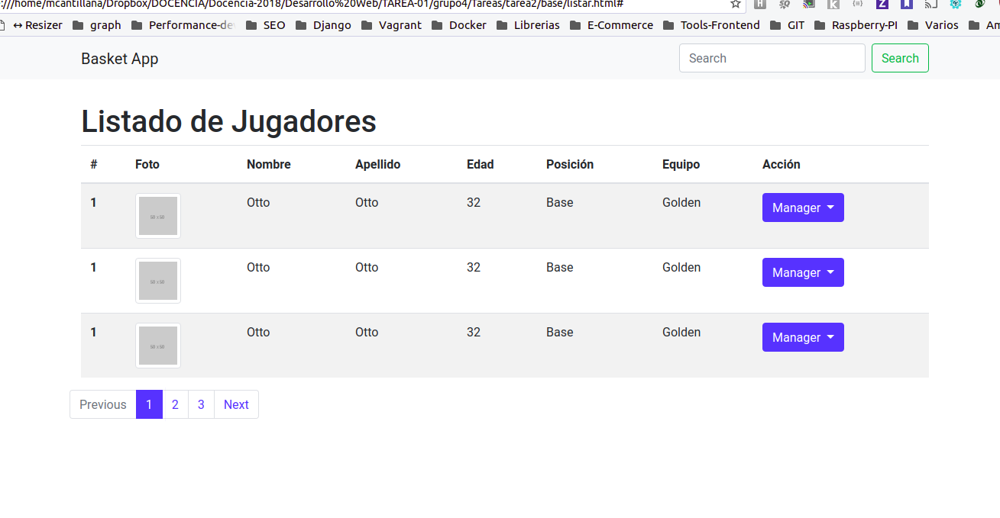
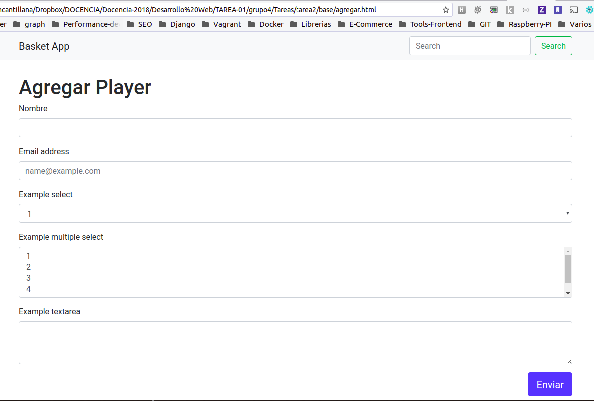

# Tarea 02
## Descripción actividad

Se pide implementar las vistas en HTML listar, editar, eliminar y agregar en base  a los siguientes html propuestos en este repositorio https://github.com/mcantillana/dw2018-views-html

Puede utilizar como base el proyecto escrito la clase pasada que está en el siguiente link https://github.com/mcantillana/dw2018-views

## Condiciones de entrega
* El proyecto debe estar versionado con GIT y gestionado a través de GITHUB
* Debe enviar el link del proyecto al email miguel [at] ewok [dot] cl 
* Asunto: DW2018-TAREA02
* Fecha de entrega: 18 Abril 2018

## Consideraciones
* Se evaluará el uso de GIT y GITHUB
* Se evaluará el uso de models en django
* Se evaluará el uso de views y templates

